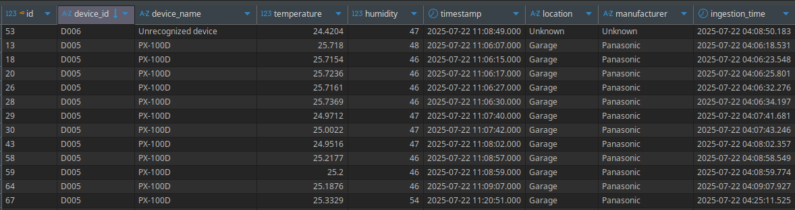

# Data Streaming IoT

## How to Prepare

1. Create virtual environment

2. Install dependencies

   ```bash
   pip install -r requirements.txt
   ```

3. Create a new `.env` file with the same keys as `sample.env`, and replace the values with your own credentials

4. On your database, run sql script inside `ddl/sql` to initialize the table

## How to Run the Script

1. Run `producer.py` in order to generate streaming data and put it in kafka topic:

   ```bash
   python producer.py
   ```

   output:

   ```
   Connecting to kafka broker...
   Connection to kafka broker successful!
   Get data streaming...
   [2025-07-22 11:20:47] Device D004: Temperature 24.8141°C, Humidity 45%
   [2025-07-22 11:20:49] Device D002: Temperature 24.7276°C, Humidity 52%
   [2025-07-22 11:20:51] Device D005: Temperature 25.3329°C, Humidity 54%
   [2025-07-22 11:20:52] Device D003: Temperature 25.6698°C, Humidity 49%
   [2025-07-22 11:20:54] Device D002: Temperature 24.7232°C, Humidity 52%
   ...
   ```

2. Run `consumer.py` in order to consume the data from kafka topic:

   ```bash
   python consumer.py
   ```

   output:

   ```bash
   Connecting to kafka broker...
   Connection to kafka broker successful!
   Connecting to PostgreSQL database...
   Connection to PostgreSQL database successful
   Getting data from topic...
   Successfuly inserting row: Device D004 read at 2025-07-22 11:20:47
   Successfuly inserting row: Device D002 read at 2025-07-22 11:20:49
   Successfuly inserting row: Device D005 read at 2025-07-22 11:20:51
   Successfuly inserting row: Device D003 read at 2025-07-22 11:20:52
   Successfuly inserting row: Device D002 read at 2025-07-22 11:20:54
   ```

   inserted rows in database:

   
